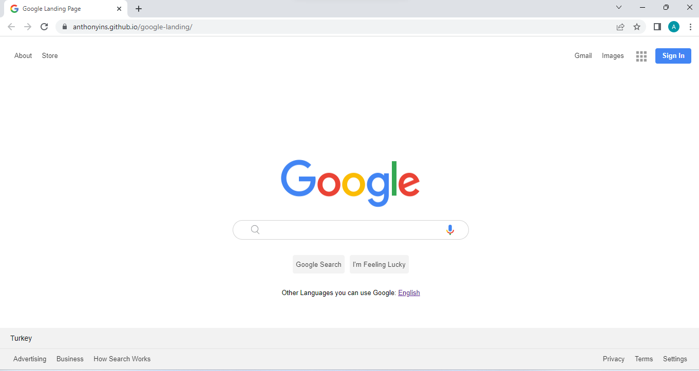

# Description
Project aims to create Google Landing Page.

## Objective
At the end of the project, following topics are to be covered;
* HTML
* List Properties
* Overflow Property-The float Property-Opacity / Transparency-Units in CSS
* CSS Setting height and width-CSS Outline-CSS Combinators

At the end of the project, students will be able to;
* improve coding skills within HTML & CSS
* use git commands (push, pull, commit, add etc.) and Github as Version Control System.

-----

### Project Skeleton:

```
    Google_Landing_Page (folder)
    |
    |----assets 
            |----css
                   |----style.css 
            |----images
                   |---- *.jpg
                   |---- *.png
    |----images_ (Images of the project)   
    |----index.html 
    |----Readme.md (Definition of the project)          

```

### Project View Images:




> Designed By DOGUKAN © Jan 2024